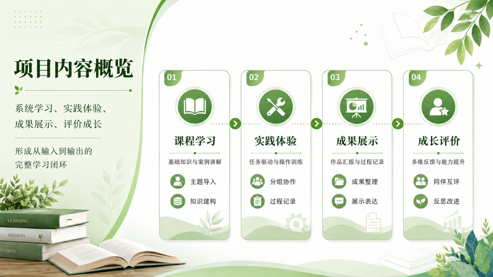
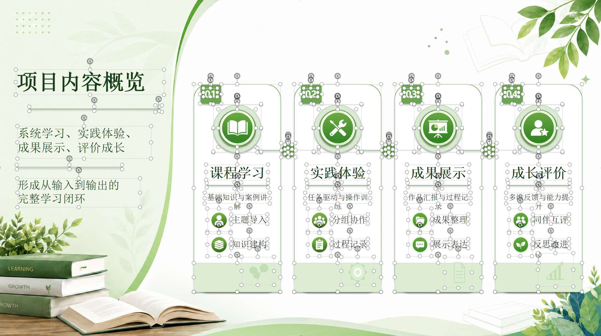

# Slide Alchemy

<p align="center">
  <strong>🧪 把图片式幻灯片重新炼成</strong><br>
  <span style="font-size: 42px; color: #ff2d2d; font-weight: 900;">完全完全</span><br>
  <strong>可编辑的 PowerPoint。</strong>
</p>

Slide Alchemy 是一个 Codex Skill，用来把图片型 PPT/PPTX、幻灯片截图、扫描版视觉页面还原成可编辑的 `.pptx`。它不是把整页截图塞回 PowerPoint 后称为“可编辑”，而是把页面拆成干净底图、可编辑几何形状、生成式 PNG 素材和真实文本框。

```text
原始幻灯片图片
-> 干净底图
-> 组件分类
-> 可编辑几何元素 + 生成式 PNG 素材 + 真实文本
-> 可编辑 PPTX
```

## ✨ 核心优势

| 优势 | 说明 |
| --- | --- |
| 🪙 **更省 token** | 先把页面分析成可复用组件，避免每一页都从零描述和重建。 |
| ⚡ **还原更快** | 重复的卡片、星星、线条、标题条和图标素材只生成一次，再跨页面复用。 |
| ✍️ **文字可编辑** | 普通文字会还原为 PowerPoint 文本框，而不是截图文字。 |
| 📐 **几何元素可编辑** | 线条、星星、卡片、标题条、圆形、边框等会尽量还原为 PPT 可编辑对象。 |
| 🧩 **复杂图标更稳定** | 奖杯、徽章、插画、光效等复杂图标保留为透明 PNG，避免硬拆后变丑。 |
| 🖼️ **底图由 AI 清理** | 底图由图像编辑模型补全，不用白块遮罩或本地粗糙 inpaint。 |
| ✨ **图标素材更干净** | PNG 图标和复杂 PNG 组件必须用图像生成/编辑模型生成素材图，再从素材图里裁剪，不能直接从原始截图上裁剪。 |

具体 token 消耗和耗时数据会在实测后补充。

## 🖥️ 示例

### 1. 智慧校园核心模块

| 图片 PPT 截图 | 可编辑 PPT 截图（所有文本框已选中） |
| --- | --- |
|  |  |

📎 文件：[`image-ppt.pptx`](examples/01-smart-campus/image-ppt.pptx) / [`editable.pptx`](examples/01-smart-campus/editable.pptx)

### 2. 项目内容概览

| 图片 PPT 截图 | 可编辑 PPT 截图（所有文本框已选中） |
| --- | --- |
|  |  |

📎 文件：[`image-ppt.pptx`](examples/02-project-overview/image-ppt.pptx) / [`editable.pptx`](examples/02-project-overview/editable.pptx)

## 🎯 为什么需要它

常见图片转 PPT 流程容易有两个问题：

1. ❌ 把整页截图放进 PPT，然后说“可编辑”。
2. ❌ 把所有元素都切成 PNG，导致线条、星星、卡片、边框这些简单元素无法编辑，而且图标容易被切残。

Slide Alchemy 使用组件化还原策略：

- ✅ **底图是图像编辑生成的，不是遮罩糊出来的。**
- ✅ **简单几何保持可编辑。**
- ✅ **复杂图标保持视觉稳定。**
- ✅ **重复组件直接复用。**

## 📦 安装

让 Codex 从这个仓库安装 skill：

```text
Install the Codex skill from https://github.com/CodingFeng101/slide-alchemy.git
```

安装后重启 Codex。

## 🚀 使用

在 Codex 中调用：

```text
Use $slide-alchemy to convert these image-style PPT slides into an editable PPTX.
```

## 🧱 元素分类策略

| 分类 | 适合元素 | 输出 |
| --- | --- | --- |
| 📐 `simple_geometry_svg_ooxml` | 线条、星星、圆形、圆环、卡片、标题条、边框、简单电路线 | PPT 可编辑几何元素 |
| 🖼️ `icon_png` | 奖杯、花、书本、爱心托举、电脑、链条、徽章 | 透明 PNG |
| 🧩 `complex_png_whole` | 漩涡、复杂光效、多层徽章、复杂插画 | 整体透明 PNG |

核心判断：

> 如果一个元素能用几何轮廓、填充色、描边描述，就做成可编辑对象；如果它依赖纹理、光影、渐变、细节堆叠，就保留为 PNG。

PNG 图标和复杂 PNG 组件必须用图像生成/编辑模型生成素材图，再从生成的素材图里裁剪。绝对不能直接从原始幻灯片截图上裁剪。

语义图标默认保留为 PNG，即使它是扁平图标或线稿图标。SVG/OOXML 只用于简单版式几何，不用于把可识别图标强行拼成 PPT 原生形状。

## 📄 许可证

MIT
